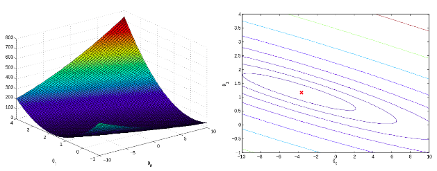
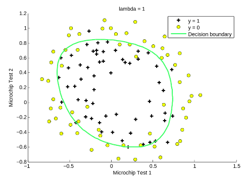
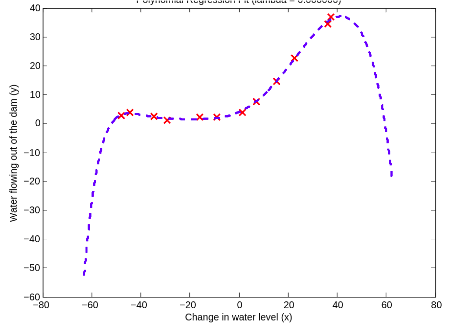
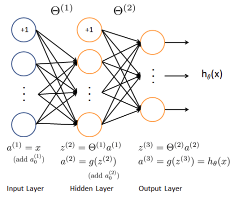
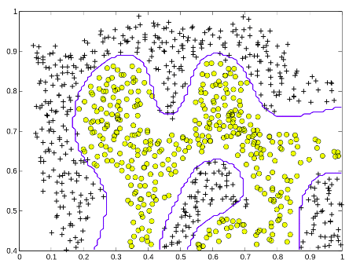
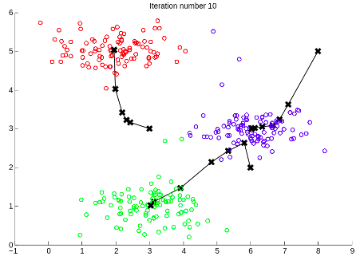
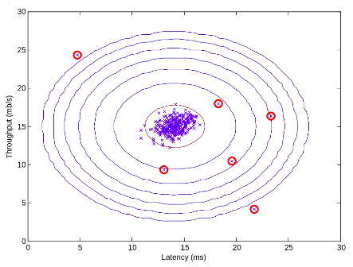
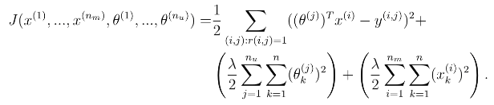

# Machine Learning in Octave/Matlab

A variety of essential ML algorithms from gradient descent to neural networks coded in Octave/Matlab with no fancy libraries. Everything including backpropagation of shallow neural network is coded with fundamental operations (+-*/) in Octave. This brought me into the ML rabbit hole and allowed me to gain a solid understanding of the mathematics behind various machine learning algorithms. 

# Topics

<table align="center" style="width:100%">
  <h3 align="center"><a href="./Linear Regression/">Single/Multivariable Linear Regression</a></h3> 
  

 
  <h3 align="center"><a href="./Logistic Regression/">Logistic Regression</a></h3> 
  

 
  <h3 align="center"><a href="./Regularized Bias vs. Variance/">Regularization</a></h3> 
  

 
  <h3 align="center"><a href="./Multi-Class and Neural Networks/">Neural Networks</a></h3> 
  

 
  <h3 align="center"><a href="./Support Vector Machines/">Support Vector Machines</a></h3> 
  

 
  <h3 align="center"><a href="./K-means Clustering and Principle Component Analysis/">K-means Clustering</a></h3> 
  

 
  <h3 align="center"><a href="./K-means Clustering and Principle Component Analysis/">Principle Component Analysis</a></h3> 
  

 
  <h3 align="center"><a href="./Anomaly Detection/">Anomaly Detection</a></h3> 
  

 
  <h3 align="center"><a href="./Anomaly Detection/">Collaborative Filtering (recommender systems)</a></h3> 
  

 
</table>
    
# Acknowledgement

As declared in the description, this collection of projects is mentored by Stanford Professor Andrew Ng through the Coursera Machine Learning . Thanks to his guidance, I got a solid understanding of the underlying math that makes ML algorithms work.
