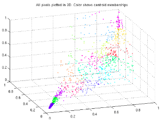

# Machine Learning in Octave/Matlab

A variety of ML algorithms from gradient descent to neural networks coded in Octave/Matlab with no fancy libraries. Everything including backpropagation of shallow neural network is coded with fundamental operations (+-*/) in Octave. This brought me into the ML rabbit hole and allowed me to gain a solid understanding of the mathematics behind various machine learning algorithms. 

# Topics

  Single/Multivariable Linear Regression
  
  Logistic Regression
  
  Regularization
  
  Shallow Neural Networks
    
  Support Vector Machines
  
  K-means Clustering
  
  Principle Component Analysis
  
  Anomaly Detection
  
  Collaborative Filtering (recommendation system)
  

    
# Acknowledgement

As declared in the description, this collection of projects is mentored by Stanford Professor Andrew Ng through the Coursera Machine Learning . Thanks to his guidance, I got a solid understanding of the underlying math that makes ML algorithms work.
